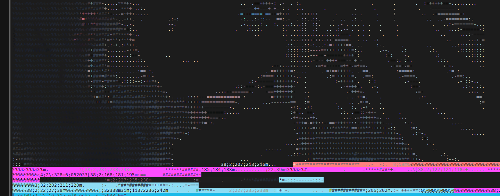

# [PYTHON] ASCII hutaoascii 

原来的作者和参考是 https://github.com/vietnh1009/ASCII-generator   

我提供了 将image批量改名 并且再win的控制台输出彩色ASCII的方法喵喵喵喵喵喵喵喵喵喵喵喵喵

运行效果是这个样子的喵喵喵

linux环境命令行效果   但是不知道为啥  生成的txt文件会有概率脏下面的

我不知道为什么到后面或者运行的时候就有概率产生这样的识别失败的问题  表面原因是因为吐字符没有涂完整 
但是实际上为啥没有吐完整 不知道   感觉需要加一个什么机制   不过我比较懒   

